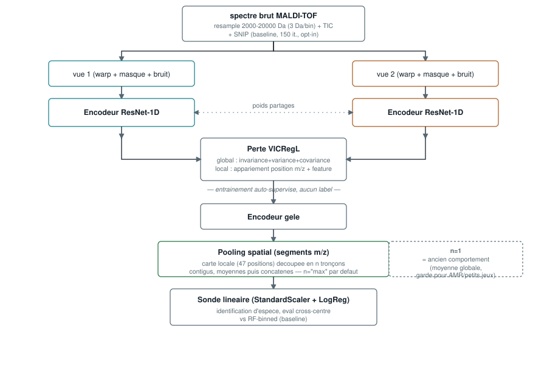
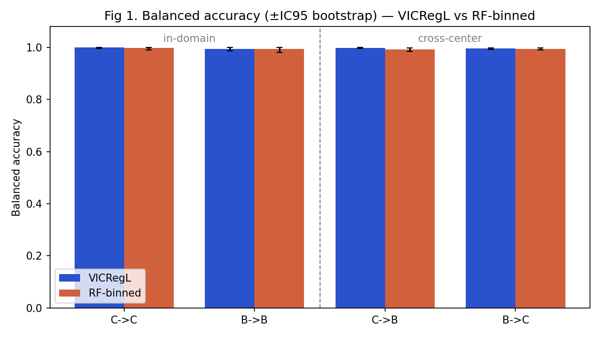
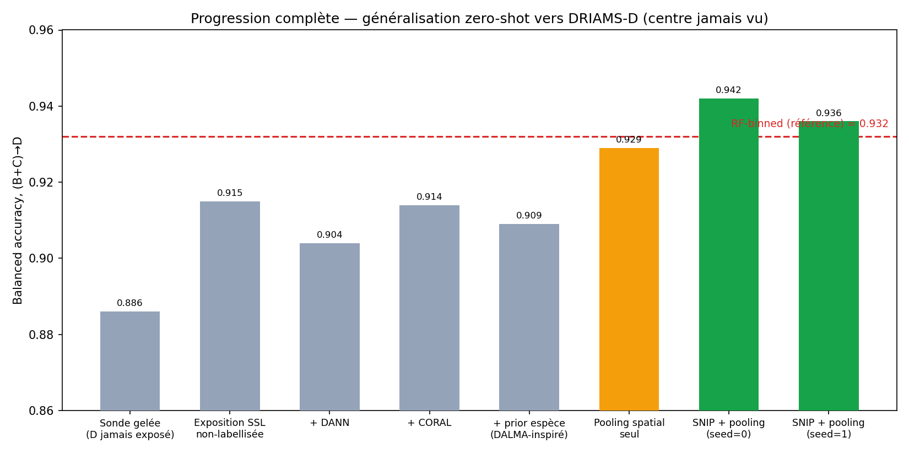
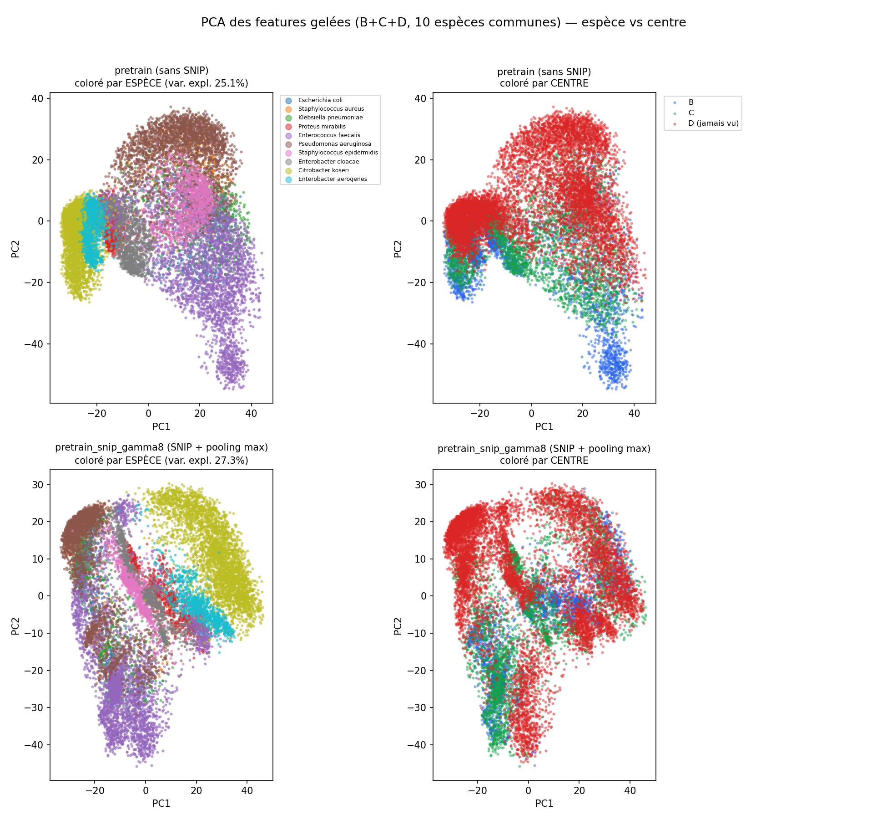
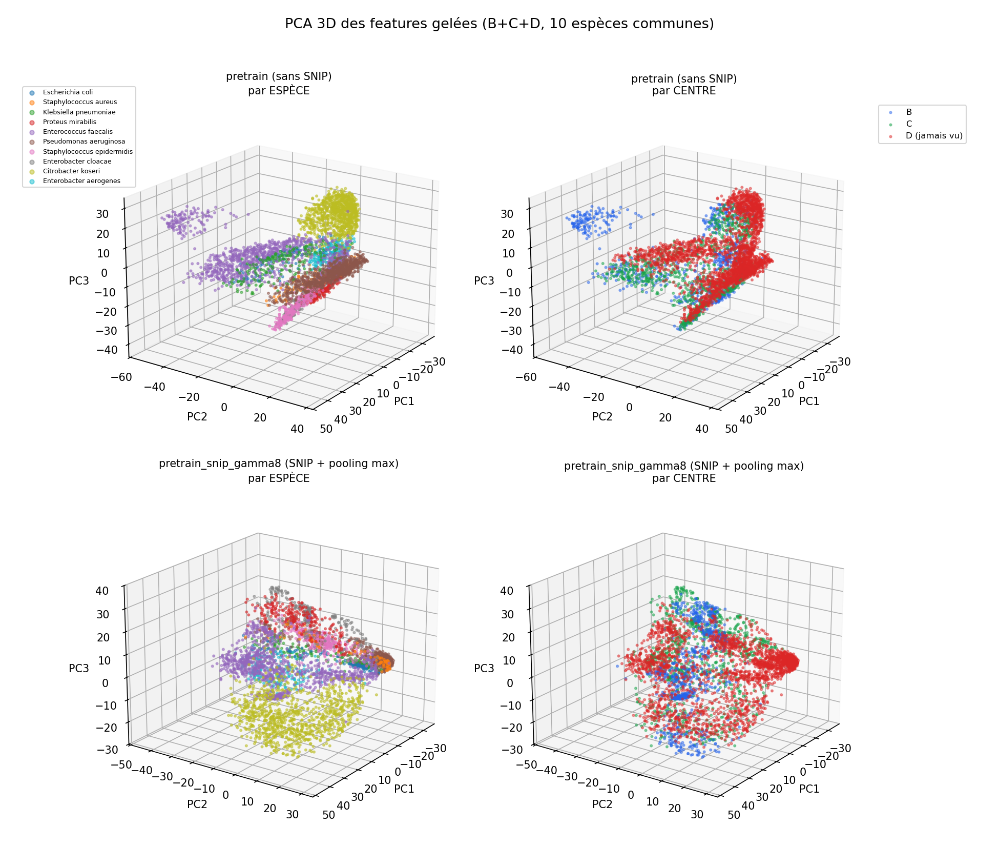

# MS-VICRegL

Identification bactérienne MALDI-TOF (DRIAMS) par **CNN 1D auto-supervisé (VICRegL)**,
sans le pré-traitement DSP lourd habituel (wavelets, SNIP, ComBat, ...).

Approche volontairement opposée à [MSClassifPy](https://github.com/agodmer/MSclassifR) /
MSclassifR : au lieu de *supprimer* les artefacts de centre/instrument par un pipeline de
signal engineering, on apprend une représentation *invariante* à ces artefacts via
auto-supervision, en préservant la structure pic-à-pic (biomarqueurs) grâce au critère
**local** de VICRegL.

> Document de travail, résultats non publiés — partagé pour discussion.
> Synthèse complète de la session la plus récente (SNIP + pooling spatial, réplication
> multi-seed, comparaison littérature) : [`docs/MS-VICRegL_synthese_SNIP_pooling.docx`](docs/MS-VICRegL_synthese_SNIP_pooling.docx).
> Données brutes derrière chaque chiffre cité ici : [`docs/results/`](docs/results/).

## Architecture (vue simplifiée)



Deux vues augmentées d'un même spectre (simulateurs d'artefacts : dérive de calibration,
masquage d'un segment m/z, gain détecteur, bruit) traversent le **même** encodeur
ResNet-1D (poids partagés, pas de stop-gradient/momentum — contrairement à BYOL/MoCo).
La sortie se sépare en un critère **global** (VICReg classique sur la représentation
moyennée) et un critère **local** (appariement des positions m/z + des features les plus
proches, top-γ), qui préserve l'information fine perdue par une représentation purement
globale. En amont, l'entrée reçoit en option une soustraction de baseline **SNIP** ; en
aval, l'encodeur gelé alimente désormais un **pooling spatial** (tronçons m/z concaténés,
au lieu d'une simple moyenne globale) avant la sonde — voir résultats ci-dessous.

Détail complet : [`docs/architecture.md`](docs/architecture.md).

## Comparaison à RF-binned

Sonde linéaire gelée sur l'encodeur VICRegL vs Random Forest sur spectres `binned_6000`
(format DRIAMS standard), mêmes labels, sur DRIAMS-B, -C, -D (Dryad
doi:10.5061/dryad.bzkh1899q). *Le `binned_6000` publié pour B était incomplet à 37% sur
Dryad (trou dans les données source) ; reconstruit intégralement via le pipeline DSP
validé de MSClassifPy avant ces chiffres — voir `scripts/11_rebuild_binned_B.py`.*

Deux ajouts validés depuis (voir synthèse) : soustraction de baseline **SNIP** (150 it.,
opt-in) et **pooling spatial** (résolution maximale de la carte locale conservée dans la
représentation gelée, au lieu d'une moyenne globale qui effaçait toute position). Les deux
combinés changent significativement les résultats ci-dessous par rapport aux premières
versions de ce README.

**Intra/cross-centre (B↔C), SNIP + pooling (γ=8, seed=1 — réplication propre) :**

| Condition | VICRegL | RF-binned | McNemar |
|---|---|---|---|
| C→C | 0.999 | 0.997 | ns |
| B→B | 0.994 | 0.994 | ns |
| C→B | 0.998 | 0.992 | ns |
| B→C | 0.995 | 0.994 | ns |



Les 4 conditions sont désormais statistiquement indiscernables de RF-binned (aucun
McNemar significatif) — sans SNIP+pooling, RF battait significativement VICRegL sur 2 des
4 conditions (voir `docs/results/pretrain/`). Sur ce benchmark, le gain rattrape RF, il ne
le dépasse pas.

**Généralisation zéro-shot vers un centre jamais vu (DRIAMS-D)** — huit méthodes, de la
sonde gelée nue jusqu'à SNIP+pooling (2 graines d'entraînement indépendantes) :



| Méthode | (B+C)→D bal-acc |
|---|---|
| Sonde gelée, D jamais exposé | 0.886 |
| Exposition SSL non-labellisée de D | 0.915 |
| + DANN (domaine-adversarial) | 0.904 |
| + CORAL (alignement de moments) | 0.914 |
| + prior par espèce (inspiré DALMA) | 0.909 |
| Pooling spatial seul (zéro ré-entraînement) | 0.929 |
| **SNIP + pooling (seed=0)** | **0.942** |
| **SNIP + pooling (seed=1, réplication)** | **0.936** |
| RF-binned (référence, indépendant de l'encodeur) | 0.932 |

Six méthodes coûteuses (ré-entraînement complet B∪C∪D, plusieurs heures chacune)
plafonnaient à 0.915. Le pooling spatial seul — un changement de pooling à l'inférence,
**zéro ré-entraînement** — fait déjà mieux ; combiné à SNIP, le gain de balanced accuracy
se maintient sur 2 graines indépendantes, toujours au-dessus de RF-binned.

**Réserve importante** : le premier run (seed=0) battait RF sur *toutes* les métriques
(accuracy brute, F1-macro, MCC, McNemar sur les prédictions brutes) ; la réplication
seed=1 confirme le gain de **balanced accuracy** mais pas cette domination plus large —
sur seed=1, RF reprend l'avantage sur accuracy/F1/MCC/McNemar brut. **Le chiffre
défendable est : gain modeste et reproductible sur la balanced accuracy (+0.004 à
+0.010 vs RF), pas une victoire propre sur toutes les métriques.** Détail dans la
synthèse `.docx` et `docs/results/`.

## Comparaison à DALMA

[DALMA](https://arxiv.org/abs/2608.08182) (Garcia-Navarro et al., août 2026) — VAE à
encodeur partagé + décodeurs par centre + prior latent conditionné par espèce,
zero-shot cross-center sur un benchmark de 7 jeux de données, 3 pays.


Sur la configuration la plus proche de la nôtre (sources DRIAMS poolées → DRIAMS-D),
notre meilleure variante (SNIP + pooling, 0.936–0.942) dépasse désormais le chiffre publié
par DALMA (0.911) et notre propre RF-binned (0.932) — à prendre avec la même prudence que
pour RF-binned ci-dessus (le gain multi-métrique n'est pas totalement reproduit sur seed=1).

Réserves, inchangées : pas la même tâche (DALMA poole 5 sources sur 3 pays incl.
MARISMa/RKI, 6 groupes d'espèces ; nous poolons B+C, 2 sites suisses du même écosystème
DRIAMS que D, 10 espèces) ni la même méthode (notre chiffre vient d'un encodeur
auto-supervisé sans label au pré-entraînement + sonde linéaire ; DALMA est entièrement
supervisé dès l'entraînement, VAE fully-connected sans convolution). C'est aussi, pour
DALMA comme pour nous, le point de comparaison le plus *facile* de leur benchmark — leurs
vrais gains apparaissent sur des transferts inter-pays/instruments (RKI→MS-UMG : brut
0.732, DALMA 0.954) qu'on n'a pas testés. Fait notable indépendant : les propres baselines
DANN/CORAL de DALMA sont elles aussi nettement dominées sur leurs sources difficiles —
cohérent avec nos résultats DANN/CORAL ci-dessus.

## Visualisation — PCA des représentations gelées



Projection PCA (features "résolution max", B+C+D, 10 espèces communes), comparant le
checkpoint de référence (sans SNIP) au meilleur checkpoint (SNIP+pooling). Les clusters
d'espèce se distinguent visuellement (partiellement — 2 axes n'expliquent que ~25-27% de
la variance d'un espace à plusieurs milliers de dimensions). Le signal de **centre**
reste visible dans les deux checkpoints — le gain de performance ne vient donc pas d'avoir
rendu les centres indiscernables, cohérent avec l'AUROC de séparabilité de domaine
(~0.998, quasi inchangé quelle que soit la méthode, `scripts/10_domain_auroc.py`).

Version 3D interactive (rotable, 4 panneaux) : [`docs/figures/pca_3d.html`](docs/figures/pca_3d.html)
— à ouvrir dans un navigateur. Vue statique :



## Installation

```bash
# l'environnement conda base contient déjà torch (MPS) + sklearn
PY=/opt/miniconda3/bin/python
$PY -m pip install -r requirements.txt
```

## Données

Tarballs DRIAMS par centre dans `data/` (source : Dryad doi:10.5061/dryad.bzkh1899q,
non inclus dans ce dépôt — voir `.gitignore`).

## Utilisation

```bash
PY=/opt/miniconda3/bin/python

# Smoke-test (données synthétiques, ~20 s) — valide tout le pipeline sans DRIAMS
$PY -m pytest tests/ -v

# Ingestion (streaming tar -> data/processed/*.npy + meta.parquet)
$PY scripts/01_ingest.py

# Pré-entraînement SSL (MPS)
$PY scripts/02_pretrain.py                                    # B + C
DOMAIN_COEFF=1.0 DOMAIN_METHOD=coral $PY scripts/02_pretrain.py B C D   # + invariance de centre (CORAL)
SPECIES_COEFF=1.0 $PY scripts/02_pretrain.py B C D            # + prior par espèce

# Variante SNIP + isolation d'un hyperparamètre (gamma) / réplication (seed)
PROFILE=medium EPOCHS=120 VARIANT=_snip GAMMA=8 SEED=1 RUN_NAME=pretrain_snip_gamma8_seed1 \
  $PY scripts/run_all.py

# Évaluation cross-centre (sonde VICRegL vs RF-binned)
$PY scripts/03_evaluate.py
VARIANT=_snip RUN_NAME=pretrain_snip_gamma8_seed1 $PY scripts/04_compare.py
$PY scripts/08_holdout_D.py --run pretrain_BCD                # centre D jamais vu
$PY scripts/08_holdout_D.py --run pretrain_snip_gamma8_seed1 --variant _snip
$PY scripts/10_domain_auroc.py pretrain_BCD pretrain_BCD_coral # diagnostic AUROC domaine
```

## Structure

| Fichier | Rôle |
|---|---|
| `ms_vicregl/config.py` | hyper-paramètres |
| `ms_vicregl/ingest.py` | tar streaming → resample → TIC → [SNIP] → memmap + labels |
| `ms_vicregl/preprocess.py` | soustraction de baseline SNIP (opt-in, `GridConfig.snip_iterations`) |
| `ms_vicregl/augment.py` | simulateurs d'artefacts (vues + coordonnées m/z) |
| `ms_vicregl/model.py` | ResNet-1D + expander global + projecteur local + `represent_segments` (pooling spatial) + modules d'invariance |
| `ms_vicregl/loss.py` | VICReg + critère local + DANN/CORAL/SpeciesPrior |
| `ms_vicregl/dataset.py` | datasets torch (vues SSL / labellisé), variantes `""`/`"_snip"` |
| `ms_vicregl/pretrain.py` | boucle SSL + extraction de features (`n_segments="max"` par défaut) |
| `ms_vicregl/evaluate.py`, `analysis.py` | sondes + comparaisons + figures |
| `scripts/` | points d'entrée numérotés (ingestion → pré-entraînement → évaluations) |
| `docs/architecture.md` | schéma détaillé, fidélité au papier VICReg/VICRegL |
| `docs/results/` | JSON/Markdown/figures bruts derrière chaque chiffre cité ici |
| `docs/MS-VICRegL_synthese_SNIP_pooling.docx` | synthèse complète (méthode, résultats, réserves) |

## Notes M3 Pro / MPS

- Tout tourne en `float32` sur MPS (le fp16/bf16 MPS est partiel).
- `num_workers=0` forcé sur MPS (DataLoader plus stable/rapide qu'avec des workers).
- Expander réduit à 2048 (vs 8192 du papier VICReg) pour tenir dans 18 Go de RAM.
- Les `.npy` sont chargés en `mmap_mode='r'` pour ne pas saturer la RAM.
