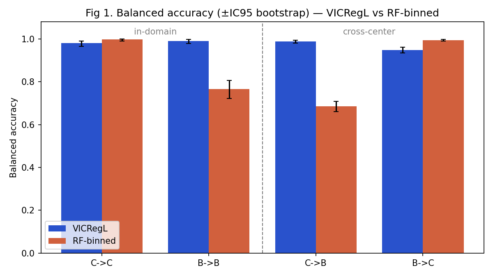
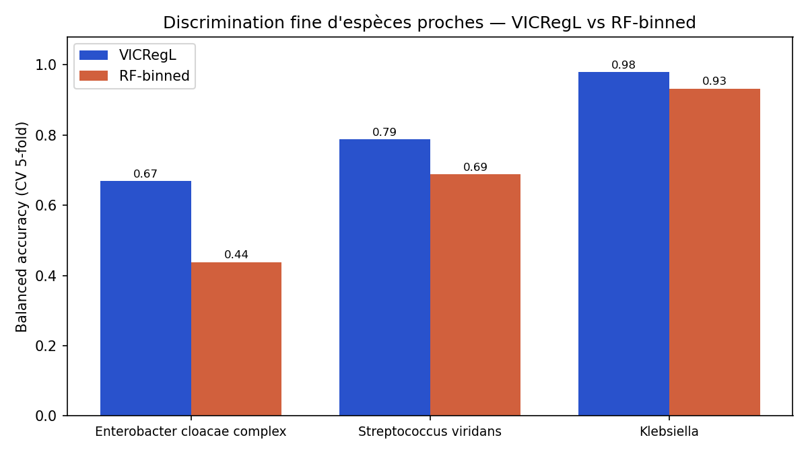
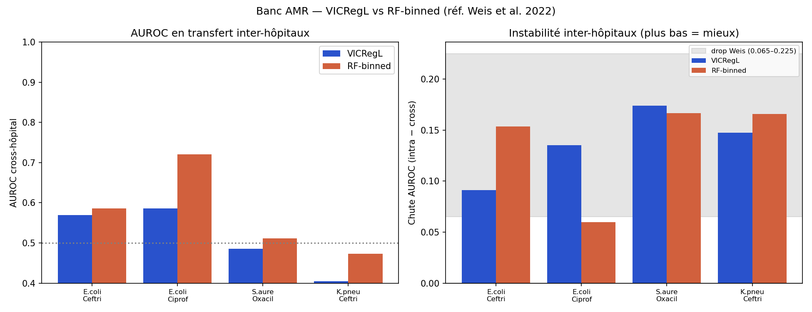
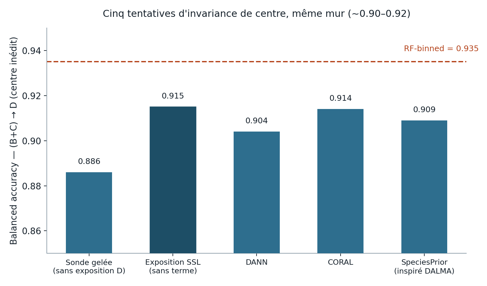
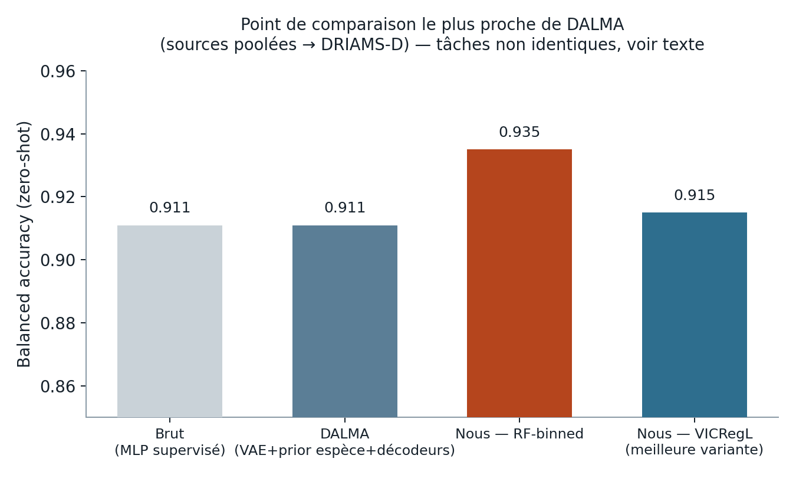

# MS-VICRegL

Identification bactérienne MALDI-TOF (DRIAMS) par **CNN 1D auto-supervisé (VICRegL)**,
sans le pré-traitement DSP lourd habituel (wavelets, SNIP, ComBat, ...).

Approche volontairement opposée à [MSClassifPy](https://github.com/agodmer/MSclassifR) /
MSclassifR : au lieu de *supprimer* les artefacts de centre/instrument par un pipeline de
signal engineering, on apprend une représentation *invariante* à ces artefacts via
auto-supervision, en préservant la structure pic-à-pic (biomarqueurs) grâce au critère
**local** de VICRegL.

> Document de travail, résultats non publiés — partagé pour discussion.

## Architecture (vue simplifiée)


Deux vues augmentées d'un même spectre (simulateurs d'artefacts : dérive de calibration,
baseline, gain détecteur, bruit, dropout de pics) traversent le **même** encodeur
ResNet-1D (poids partagés, pas de stop-gradient/momentum — contrairement à BYOL/MoCo).
La sortie se sépare en un critère **global** (VICReg classique sur la représentation
moyennée) et un critère **local** (appariement des positions m/z + des features les plus
proches, top-γ), qui préserve l'information fine perdue par une représentation purement
globale. Un module optionnel d'invariance de centre (DANN, CORAL, ou un prior par espèce
inspiré de DALMA) peut s'ajouter à la perte — testé, résultat négatif (voir plus bas).

Détail complet : [`docs/architecture.md`](docs/architecture.md).

## Résultats

Toutes les évaluations comparent une sonde linéaire gelée sur l'encodeur VICRegL à un
Random Forest sur spectres `binned_6000` (format DRIAMS standard), même labels
(Biotyper/MALDI — voir limite ci-dessous), sur DRIAMS-B, -C, -D (Dryad
doi:10.5061/dryad.bzkh1899q).

### 1 — Stabilité intra/cross-centre

| | VICRegL | RF-binned |
|---|---|---|
| Balanced accuracy, 4 conditions B↔C | **0.95–0.99** (écart 0.04) | 0.685–0.997 (écart 0.31, s'effondre même en intra-centre B→B à 0.765) |



### 2 — Discrimination fine de sous-espèces proches (5-fold CV, B∪C)

| Groupe | VICRegL | RF-binned |
|---|---|---|
| *Enterobacter cloacae* complex (5 classes) | **0.669** | 0.438 (RF fusionne tout → *E. cloacae*) |
| *Streptococcus viridans* (3 classes) | **0.788** | 0.688 |
| *Klebsiella* (3 classes) | **0.979** | 0.932 |



McNemar p<0.01 sur les 3 groupes. **Limite à connaître :** les labels DRIAMS sont issus du
Biotyper (MALDI), pas de séquençage — impossible de revendiquer "battre le MALDI" avec des
labels MALDI (0 *Shigella* dans B+C, indissociable d'*E. coli* pour le Biotyper). Design
MSclassifR/Godmer (labels moléculaires) nécessaire pour trancher cette question.

### 3 — AMR (résultat négatif, informatif)

Comparaison à Weis et al. 2022 (*Nat Med*) sur *K. pneumoniae* :

| | VICRegL | RF-binned | Weis et al. 2022 |
|---|---|---|---|
| AUROC, E. coli/ceftriaxone | 0.660 | 0.739 | 0.75 (valide notre pipeline RF) |



RF bat VICRegL sur les 4 scénarios testés ; la chute cross-site est identique pour les deux
(+0.137, dans la fourchette Weis 0.065–0.225). Interprétation : l'invariance apprise
(notamment le dropout de pics) supprime en partie le signal faible dont l'AMR a besoin —
l'invariance est **spécifique à la tâche**, pas gratuite.

### 4 — Généralisation zéro-shot à un centre jamais vu (DRIAMS-D)

Cinq tentatives pour faire generaliser l'encodeur à un centre totalement inédit (DRIAMS-D,
jamais vu même en non-labellisé pour la 1ère condition) :



| Méthode | (B+C)→D bal-acc |
|---|---|
| Sonde gelée, D jamais exposé | 0.886 |
| Exposition SSL non-labellisée de D (meilleure) | **0.915** |
| + DANN (domaine-adversarial) | 0.904 |
| + CORAL (alignement de moments) | 0.914 |
| + prior par espèce (inspiré [DALMA](https://arxiv.org/abs/2608.08182)) | 0.909 |
| RF-binned (référence, indépendant de l'encodeur) | **0.935** |

**Aucune des méthodes testées ne bat RF-binned sur ce transfert.** Fait notable : un
classifieur de domaine entraîné *après coup* sur les features gelées les sépare presque
parfaitement (AUROC ~0.998) **dans les 5 cas**, y compris quand le terme d'invariance
converge proprement sur son propre objectif (CORAL, prior espèce) — signe que
l'information de centre survit dans une structure que ces mécanismes ne touchent pas.
Diagnostic complet, y compris un piège méthodologique généralisable (le signal
d'invariance *en ligne* peut être totalement déconnecté du résultat *hors-ligne*) :
[`docs/results.md`](docs/results.md).

### Comparaison à DALMA (Garcia-Navarro et al., août 2026)



Sur la configuration la plus proche de la nôtre (sources DRIAMS poolées → DRIAMS-D), notre
meilleure variante (0.915) est dans la même fourchette que le chiffre publié par DALMA
(0.911) — **mais ce n'est pas la même tâche** (sources, espèces et méthode différentes ;
voir réserves dans `docs/results.md`). C'est aussi, pour DALMA comme pour nous, le point de
comparaison le plus *facile* de leur benchmark — leurs vrais gains apparaissent sur des
transferts inter-pays/instruments qu'on n'a pas testés.

## Ce qui tient, ce qui reste ouvert

- **Solide :** stabilité cross-centre (1) et discrimination fine (2), sans pré-traitement
  DSP lourd — complémentaire à DALMA, qui n'a qu'une représentation globale.
- **Négatif mais informatif :** AMR (3), et la généralisation zéro-shot stricte (4) — cinq
  mécanismes différents échouent au même endroit, ce qui pointe vers quelque chose de
  structurel (probablement des différences systématiques de bas niveau, instrument/
  calibration) plutôt qu'un mauvais choix de régulateur.
- **Pas encore testé :** fine-tuning (sonde non gelée), correction test-time à
  l'inférence, prior par espèce variationnel (vraie KL, DALMA-fidèle), corpus DRIAMS-A
  (jamais ingéré — le corpus SSL actuel ne fait que B+C(+D), ~10-21k spectres).

## Installation

```bash
# l'environnement conda base contient déjà torch (MPS) + sklearn
PY=/opt/miniconda3/bin/python
$PY -m pip install -r requirements.txt
```

## Données

Tarballs DRIAMS par centre dans `data/` (source : Dryad doi:10.5061/dryad.bzkh1899q,
non inclus dans ce dépôt — voir `.gitignore`).

## Utilisation

```bash
PY=/opt/miniconda3/bin/python

# Smoke-test (données synthétiques, ~20 s) — valide tout le pipeline sans DRIAMS
$PY -m pytest tests/ -v

# Ingestion (streaming tar -> data/processed/*.npy + meta.parquet)
$PY scripts/01_ingest.py

# Pré-entraînement SSL (MPS)
$PY scripts/02_pretrain.py                                    # B + C
DOMAIN_COEFF=1.0 DOMAIN_METHOD=coral $PY scripts/02_pretrain.py B C D   # + invariance de centre (CORAL)
SPECIES_COEFF=1.0 $PY scripts/02_pretrain.py B C D            # + prior par espèce

# Évaluation cross-centre (sonde VICRegL vs RF-binned)
$PY scripts/03_evaluate.py
$PY scripts/08_holdout_D.py --run pretrain_BCD                # centre D jamais vu
$PY scripts/10_domain_auroc.py pretrain_BCD pretrain_BCD_coral # diagnostic AUROC domaine
```

## Structure

| Fichier | Rôle |
|---|---|
| `ms_vicregl/config.py` | hyper-paramètres |
| `ms_vicregl/ingest.py` | tar streaming → resample → TIC → memmap + labels |
| `ms_vicregl/augment.py` | simulateurs d'artefacts (vues + coordonnées m/z) |
| `ms_vicregl/model.py` | ResNet-1D + expander global + projecteur local + modules d'invariance |
| `ms_vicregl/loss.py` | VICReg + critère local + DANN/CORAL/SpeciesPrior |
| `ms_vicregl/dataset.py` | datasets torch (vues SSL / labellisé) |
| `ms_vicregl/pretrain.py` | boucle SSL + extraction de features |
| `ms_vicregl/evaluate.py`, `analysis.py`, `finegrain.py`, `amr.py` | sondes + comparaisons + figures |
| `scripts/` | points d'entrée numérotés (ingestion → pré-entraînement → évaluations) |
| `docs/architecture.md` | schéma détaillé, fidélité au papier VICReg/VICRegL |
| `docs/results.md` | narration complète des résultats (RESULT 1-8) |

## Notes M3 Pro / MPS

- Tout tourne en `float32` sur MPS (le fp16/bf16 MPS est partiel).
- `num_workers=0` forcé sur MPS (DataLoader plus stable/rapide qu'avec des workers).
- Expander réduit à 2048 (vs 8192 du papier VICReg) pour tenir dans 18 Go de RAM.
- Les `.npy` sont chargés en `mmap_mode='r'` pour ne pas saturer la RAM.
