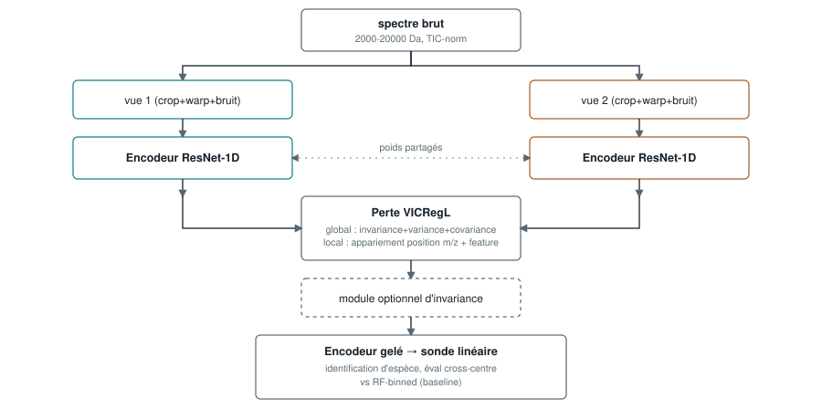

# Architecture

## Vue d'ensemble

1. **Entrée** : spectre rééchantillonné sur une grille commune (2000–20000 Da, L=6000,
   3 Da/bin) + normalisation TIC seulement — pas de wavelets, pas de SNIP, pas de ComBat.
2. **Augmentation** (`augment.py::make_views`) : deux vues du même spectre, chacune passée
   par une transformation de coordonnées (crop + warp non-linéaire = dérive de
   calibration) puis des perturbations d'intensité (baseline, gain détecteur, dropout de
   pics, bruit). Les coordonnées m/z source sont suivies à travers le crop+warp et
   pooled à la résolution de la carte de features (L'=47) — c'est ce qui rend
   l'appariement de position du critère local *réel* (pas une étiquette arbitraire).
3. **Encodeur** (`model.py::ResNet1DEncoder`) : ResNet-1D (stem + 4 stages, canaux
   64→128→256→512, 2 blocs résiduels/stage), **poids partagés** entre les deux vues,
   **pas** de stop-gradient ni de momentum (contrairement à BYOL/MoCo). Sortie : carte de
   features `(B, 512, 47)`.
4. **Deux têtes** :
   - `repr_ = fmap.mean(dim=2)` → **la représentation évaluée en aval** (sonde
     linéaire) → `global_expander` (MLP 512→2048³) → embedding global `g`.
   - `fmap` → `local_projector` (conv1×1 ×3, 512→512) → carte locale `z` `(B, 512, 47)`.
5. **Perte VICRegL** (`loss.py`) :
   - critère **global** : VICReg classique sur `g1, g2` (invariance MSE + variance
     `relu(1-std)` + covariance hors-diagonale), coefficients `(sim,std,cov)=(25,25,1)`.
   - critère **local** : appariement par **position** (distance `|coords1-coords2|`
     minimale) et par **feature** (plus proche voisin L2 dans `z`), chacun symétrisé
     (1→2 et 2→1), ne gardant que les `top-γ` correspondances les plus proches ; chaque
     paire retenue est notée par le même critère VICReg à 3 termes.
   - combinaison : `L = α·global + (1-α)·local`, `α=0.75`.
6. **Module optionnel d'invariance de centre** (`domain_coeff`/`species_coeff` > 0,
   désactivés par défaut ; aucune des trois méthodes ne bat RF-binned en zero-shot —
   voir le score-card dans le [README](../README.md)) :
   - **DANN** : tête de classification de centre derrière un gradient-reversal layer.
   - **CORAL** : alignement direct moyenne+covariance entre centres présents dans le
     batch, sans réseau auxiliaire.
   - **SpeciesPrior** (inspiré [DALMA](https://arxiv.org/abs/2608.08182)) : prototype
     appris par espèce, `repr_` tiré vers lui par MSE — adaptation déterministe du prior
     conditionné de DALMA (notre encodeur n'a pas de tête de variance/reparamétrisation,
     donc pas de vraie KL possible telle quelle).
7. **Aval** : seul `model.encoder` est conservé (poids figés) → `repr_` sur spectre brut
   non augmenté → sonde linéaire (`StandardScaler` + `LogisticRegression`) ou RF-binned
   sur `binned_6000`, comparés sur des splits identiques.

## Fidélité au papier VICReg / VICRegL

| Aspect | Papier (VICReg / VICRegL) | Cette implémentation | Verdict |
|---|---|---|---|
| Coefficients de perte | (λ,μ,ν) = (25, 25, 1) | `sim,std,cov = 25, 25, 1` | identique |
| Poids global/local | α = 0.75 | `alpha = 0.75` | identique |
| Correspondance locale | position (via crop) + feature (plus proche voisin), symétrisée | idem, coordonnées m/z réellement suivies à travers crop+warp | mécanisme fidèle |
| Top-γ | ≈ 20 (config image) | `gamma = 20` (corrigé le 2026-08-21, était 8) | identique après correction |
| Tête expander | MLP 3 couches, 8192 | MLP 3 couches, 2048 | réduit (RAM 18 Go), assumé dans le code |
| Dorsale | ResNet-50 (images 2D) | ResNet-1D maison, 64-128-256-512 | adaptation attendue (1D vs 2D) |
| Augmentations | crop / couleur / flou (images) | simulateurs d'artefacts MALDI | adaptation nécessaire au domaine |
| Encodeur | poids partagés, pas de stop-gradient/momentum | idem | identique |

Le cœur (perte, pondérations, double critère local avec vraie correspondance de
position, absence de stop-gradient) est fidèle au papier. Les écarts de taille
(expander, dorsale) sont des adaptations disclosées, pas des approximations
silencieuses.

## Profils de configuration

`light_config` / `medium_config` (utilisés en pratique pour tenir sur un Mac M3 Pro 18 Go
sans surchauffe) réduisent les canaux et la profondeur, mais gardent la même topologie et
les mêmes coefficients de perte que la config par défaut décrite ci-dessus.
